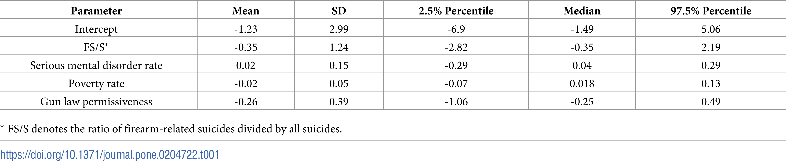

```{r setup, include=FALSE}
knitr::opts_chunk$set(echo = FALSE)

library(tidyverse)
library(readxl)
library(janitor)
library(tinytex)
library(bookdown)
library(gt)
library(rstanarm)
library(stargazer)
library(knitr)
```

# Abstract

Lin et al. (2018) found that the time interval between mass shootings has been drastic decreasing in the past three decades, suggesting that the rate of shootings are increasing. I was able to replicate all of the results from Lin et al. (2018), but while I was able to replicate the inconclusive results in table 1, I was not able to replicate the exact zero-inflated Poisson model. My extension broke down the interval trends between different venues of shootings showing in figure 2 of Lin et al. (2018). I found that the interval trend of mass school shootings remained relatively steady while the interval between mass workplace shootings and other mass shootings drastically decreased since 2008. This suggests that more research should be done looking at why workplace mass shootings has specifically increased drastically since 2015.


# Introduction

The main finding by Lin et al. (2018) was that the model they created using associated risk factors for mass shootings such as gun ownership, mental illness, poverty, and gun laws provided inconclusive results when predicting the number of mass shootings per state they looked at from Mother Jones. @motherjones However, the authors also found importance evidence surrounding the interval between mass shootings. Overall, they found that the interval between all mass shootings has been on the decline since the 1982, the year of the first mass shootings in the Mother Jones dataset. @motherjones Additionally, they also found evidence of a correlation between an increasing media coverage and online search interest of mass shootings and the decreasing interval of mass shootings. However, the authors only looked at online reports and did not include data from social media coverage or interest surrounding mass shootings.

I was able to replicate all the results found by Lin et al. (2018). The authors kindly made the data available alongside their paper. @paper However, the original code used for the graphics was not included with the paper and I was unable to access the original code. As a result, I was unable to recreate the exact zero-inflated Poisson model in table 1 of the paper. Instead, I created a Poisson model using a Bayesian regression modeling package that produced the same inconclusive results. @rstanarm My replication was done in R and is public ally accessible via GitHub. [^1] @R

My extension focused deeper in the decreasing interval between mass shootings. Specifically, I broke down the overall decreasing interval into the three most popular venues of shootings: school, workplace, and other. Then, I recreated figure 2 from Lin et al. (2018) only separating the three categories. The results show that the interval between mass school shootings has stayed relatively flat and has not changed significantly since 1982. So, mass school shootings had a relatively low impact on the overall decreasing interval between mass shootings. Instead, the decrease was a result of mass workplace shootings and other mass shootings.

# Literature Review

This study resulted from limited published findings in the past and wanted to identify some risk factors associated with mass shootings. As a result, the authors wanted to answer three specific questions related to mass shootings in this paper. 1. "What are the population-level factors associated with the probability of mass shootings?" 2. "Is the incidence rate of mass shooting increasing during the past three decades?" 3. "Is the online media associated with the probable 'contagious effect'?" The specific factors looked at in this paper include: "state-level gun ownership rate, serious mental illness rate, poverty percentages, and gun law permissiveness". To evaluate if there was an increase in mass shootings in the past three decades, the authors looked at data regarding "mass shootings that occurred within the U.S. in the past 30 years". The authors of the paper defined mass shooting "as an act of firearm violence that resulted in at least four fatalities (not including the perpetrator), at the same time, or over a relatively short period of time in the case of shooting sprees". The contagious effect is like a copy cat effect, where if one mass shooting occurs, it promotes the increase of "copy cats" or more mass shootings in the time that follows.

The authors findings ultimately reached inconclusive evidence for looking at the relationship between risk factors and the number of mass shootings. One of the main difficulties with looking at risk factors for mass shootings is the relatively small amount data on shootings that researchers have to look at. However, they did find the the interval between mass shootings has been steadily decreasing for the past three decades. Further, they found evidence of possible relationship between the increasing amount of media coverage of mass shootings and this interval decrease. However, the research done by Lin did not look at the specific number of social media posts mentioning mass shootings, only Google search results and Google trends. This is an area where research should be done because of the increasing popularity of social media, especially among the youth. Overall, the research done by Lin provided important information around the decreasing intervals which can be useful for further research to see how the interval trends have changed since the paper's publication.

In the overall category of research related to mass shootings, there have been two areas of main focus, continuing to look at what risk factors relate to mass shootings the most and domestic violence restraining order (DVRO) prohibition laws. In the focus of looking at risk factors, many other papers have also reached inconclusive evidence on many of the same factors that Lin looked at. Other papers have cited similar a similar issue with the lack of data to provide any substantive conclusions on risk factors. However, a recent Webster et al. (2020) paper found that more firearm purchaser licensing requirements are likely to reduce the number of mass shootings as it makes it more difficult for high-risk individuals to purchase guns. @webster Regarding the focus on DVRO, there was a lot of excitement around a paper by Zeoli et al. (2017) because he had found evidence that DVRO laws can significantly reduce the number of shootings related to domestic violence. @zeoli2017 This would have been a huge finding since many mass shootings are related to domestic violence. However, the paper by Zeoli et al. was later retracted shortly after due to errors within dates they used which led to the significance of DVRO laws to fade. @zeoli2018


# Replication

I was able to replicate all of the findings from Lin et al. (2018) from the inconclusive results of using the risk factors to try and predict the cause of mass shootings to the decreasing interval between mass shootings over time and over media coverage density. However, while I was able to replicate the inconclusive results of using risk factors to try and predict the number of mass shootings per state, I was unable to replicate the exact zero-inflated Poisson model created by Lin et al (2018). This was mainly due to not having the original code used to make the model available and my unfamiliarity with zero-inflated Poisson models. Instead, I created a Poisson regression using a Bayesian regression modeling package in R. @rstanarm @R

```{r figure 1, fig.height = 4, include=FALSE}

# Using fig.height to scale the graphic correctly when it prints to pdf

# Reading in the data, using head(100) to get the 100 mass shootings that we
# want and filtering longitude > -140 to remove a shooting in Hawaii that is not
# present in the figure created in the paper. Clean names to get better column
# names.

data <- read_xlsx("raw-data/Mother Jones - Mass Shootings Database 1982 - 2018.xlsx") %>%
  head(100) %>%
  filter(longitude > -140) %>%
  clean_names()

# Getting a map of the United States using map_data, from the ggplot2 package

usa <- map_data("state")

data %>%
  ggplot() +
  geom_polygon(data = usa, aes(x = long, y = lat, group = group), fill = "white", colour = "black") +
  geom_point(data = data, aes(x = longitude, y = latitude, size = fatalities), color = "red", shape = 1, show.legend = FALSE) +
  scale_size(range = c(0, 12)) +
  theme_void() +
  labs(caption = "Figure 1. Geographic locations of shootings and respective fatalities (proportional to circle diameter) are presented.")

```

```{r table 1, results = "asis", include=FALSE}

# This is my attempt to recreate the regression model output in figure 1. I've
# been having trouble replicating the exact model because of missing/unknow data
# regarding FS/S (firearm suicides) that is not in the dataset given.

data_1 <- read_xlsx("raw-data/Gun ownership data.xlsx")

# Close! However, this model is not zero-inflated and it does not have population as an offset

fit_1 <- stan_glm(Massshooting ~ Gun_ownership_rate + SeriousMentalIllness + pov_percentage + gun_laws, data = data_1, family = poisson, refresh = FALSE)

# https://stats.idre.ucla.edu/r/dae/zip/ This was my attempt to replicate the
# zero-inflated poisson model. Unsuccessful. Using the pscl package

# fit_2 <- zeroinfl(Massshooting ~ Gun_ownership_rate + SeriousMentalIllness + pov_percentage + gun_laws, data = data_1, subset = pop_2000)

stargazer(data.frame(fit_1), type = "latex",
          summary.stat = c("mean", "sd"),
          covariate.labels = c("Intercept", "FS/S", "Serious mental disorder rate", "Poverty rate", "Gun law permissiveness"),
          title = "Effect of Treatment, Time Length, and their Interaction on Change in attitude",
          header = FALSE)

```

```{r figure 2, include=FALSE}

# Reading in the data, using head(100) to get the 100 mass shootings that we
# want and clean names to get better column names. Using drop NA to remove one
# row with NA interval

data <- read_xlsx("raw-data/Mother Jones - Mass Shootings Database 1982 - 2018.xlsx") %>%
  head(100) %>%
  clean_names() %>%
  drop_na(interval) %>%
  mutate(date = as.Date(date))

dates <- as.Date(c("1982-07-01", "1988-07-01", "1994-07-01", "2000-07-01", "2006-07-01", "2012-07-01", "2018-07-01"))

# Making the graphic showing inter-incidence interval (days) versus Date of all
# the shootings. I can't seem to get the first date to show up though...been
# trying for an hour now.

data %>%
  ggplot(aes(x = date, y = interval)) +
  geom_point(shape = 1, size = 2) +
  scale_y_continuous(breaks = c(2, 5, 10, 20, 50, 100, 200, 500, 1000), trans = "log") +
  scale_x_date(breaks = dates, date_labels = "%m/%Y") +
  geom_smooth(method = "gam", formula = y ~ s(x), se = FALSE) +
  theme_classic() +
  labs(x = "Date",
       y = "Inter-incidence Interval (days)",
       caption = "Figure 2. Interval time between mass shootings and its GAM fit for trend is shown.")

```

```{r table 2, include=FALSE}

# Making the table using the formula they used

prob_data <- tibble(months = c(1, 2, 3, 6, 9, 12)) %>%
  mutate(constant_rate = 1 - exp(-0.227 * months),
         regression_rate = 1 - exp(-0.468 * months)) 

# Using gt to make a nice table.

round(prob_data, digits = 3) %>%
  gt() %>%
  cols_align("center") %>%
  cols_label(
    months = "Within months (t)",
    constant_rate = "P of a shooting Using constant rate",
    regression_rate = "P of a shooting Using regression model"
  )
```

```{r figure 3, fig.height = 4, include=FALSE}

# Using fig.height bc cowplot and all other methods to display the two grpahics
# together were resizing the figures so it was ugly and difficult to clearly
# interpret

# Reading in the data, doing head(65) because the rows below that have NA values

data_3 <- read_xlsx("raw-data/Mother Jones - Mass Shootings Database 1982 - 2018.xlsx") %>%
  clean_names() %>%
  head(65) %>%
  mutate(log_media_density = as.numeric(log_media_density))

data_3 %>%
  ggplot(aes(x = log_media_density, y = log(interval))) +
  geom_point() +
  stat_smooth(method = "loess", formula = y ~ x, span = 1) +
  theme_classic() +
  labs(y = "Between-shooting time interval",
       x = "Media coverage density",
       tag = "A") +
  xlim(c(4, 11))

data_3 %>%
  ggplot(aes(x = log_transformed_search_interest, y = log(interval))) +
  geom_point() +
  stat_smooth(method = "loess", formula = y ~ x, span = 1) +
  theme_classic() +
  labs(y = "Between-shooting time interval",
       x = "Online search interest",
       tag = "B") +
  xlim(c(-2, 6))
```

# Extension

I extended Lin et al. (2018) by taking into account the venue of the mass shootings from 1982 to 2018 and visualizing the trends between the three largest categories: School, Workplace, and Other. Additionally, I downloaded the updated mass shooting dataset from Mother Jones' and created the same visualization with the three largest venues with data up to 2020. @motherjones 

## Venue Categories

Throughout Lin et al. (2018), the authors categorized every mass shooting in the data into one. However, the shooters' motive is an important factor when studying the causes for mass shootings and trying to prevent future shootings. Looking at all the venues of shootings categorized in this dataset, it would be natural to assume that the shooters' would have varying motives: Airport, Military, Other, Religious, School, and Workplace. For example, a shooter who attacks a religious venue might have racist motives while a shooter who attacks a school might have been acting on revenge against bullies. So, I decided to break down figure 2 by Lin et al. (2018) into three venue categories: School, Workplace, and Other. I chose these three because they were the three most common venues and the others all had five or less shootings. To keep the number of datapoints that same, I put these smaller venues into the category of Other.

```{r extension figure 4, fig.height = 4}

# Using fig.height to scale the graphic correctly when it prints to pdf

# Reading in the data as done for figure 2, but cleaning the venues to just
# three. Venues with less than 6 datapoints were coded along with Other

data <- read_xlsx("raw-data/Mother Jones - Mass Shootings Database 1982 - 2018.xlsx") %>%
  head(100) %>%
  clean_names() %>%
  mutate(date = as.Date(date)) %>%
  mutate(venue = case_when(
    venue %in% c("Airport", "Military", "Religious", "Other\r\n", "Other") ~ "Other",
    venue %in% c("\r\nWorkplace", "Workplace") ~ "Workplace",
    venue == "School" ~ "School"
  ))

# Function for recalculating intervals

calc_interval <- function(given_data, location) {
  
  # Filtering for specific venues
  
  data_temp <- given_data %>%
    filter(venue == !!location) %>%
    arrange(date)
  
  # Getting the dates to make a new column (for calculating difftime next)
  
  date_temp <- c(as.Date(NA), data_temp$date) %>%
    head(-1)
  
  # Calculating interval using difftime
  
  data_temp <- data_temp %>%
    mutate(date2 = date_temp,
         interval = as.numeric(difftime(date, date2, units = "days")))
  
  # Returning a tibble
  
  return(data_temp)
}

# Recalculating the intervals for all three venues

data_school <- calc_interval(data, "School")
data_workplace <- calc_interval(data, "Workplace")
data_other <- calc_interval(data, "Other")

# Binding the three venue tibbles together and removing NAs

data <- bind_rows(data_school, data_workplace, data_other) %>%
  drop_na(interval)

# Making dates for x-axis

dates <- as.Date(c("1982-07-01", "1988-07-01", "1994-07-01", "2000-07-01", "2006-07-01", "2012-07-01", "2018-07-01"))

# Making the graphic showing inter-incidence interval (days) versus Date of all
# the shootings. I can't seem to get the first date to show up though...been
# trying for an hour now.

data %>%
  ggplot(aes(x = date, y = interval, color = venue)) +
  geom_point(shape = 1, size = 2) +
  scale_y_continuous(breaks = c(2, 5, 10, 20, 50, 100, 200, 500, 1000), trans = "log") +
  scale_x_date(breaks = dates, date_labels = "%m/%Y") +
  geom_smooth(method = "gam", formula = y ~ s(x), se = FALSE) +
  theme_classic() +
  labs(x = "Date",
       y = "Inter-incidence Interval (days)",
       caption = "Figure 4. Interval time between mass shootings based on venue. Trends using GAM",
       color = "Venue")

```

The results reveal some interesting information between the three venues. When broken down into more specific categories, the trends show that not all venues have seen an equal downward trend in intervals between shootings. The trend looking at mass shootings at schools is perhaps the most interesting, as it shows only a slight decrease overall. This suggests that the number of mass shootings at schools today might not actually be much different than in the 80s. The trend seems to hover around every one year. On the other hand, the interval between mass shootings at workplaces has drastically fallen since around 2015 from one every few years to one every month in 2018. Before that, the interval seemed to be increasing from one every 200 days in 2000 to one every few years in 2008. This is an interesting trend because workplace mass shootings might not be as frequently reported on in comparison to mass school shootings which gain national media attention. Looking at shootings that occurred in other venues, the trend aligns closer to the overall trend in figure 2 by Lin et al. (2018) of an overall decreasing trend in the interval between shootings.

## 2020 Data

Bringing in the new data on mass shootings from Mother Jones', I created the same three categories of venues and created a similar visualization. @motherjones Since 2018, there has been no new mass shootings that occurred at a school, so that trend does not change. The trend on workplace mass shootings has decreased slightly from every month to about every month and a half. This might suggest that the trend is flattening out.

```{r extension figure 5, warning=FALSE, fig.height = 4}

# Using fig.height to scale the graphic correctly when it prints to pdf

# Setting warning to false because of duplicate column name, I renamed it to
# Venue.

# Reading in the data and cleaning just as I did previously.

new_data <- read_csv("raw-data/Mother Jones - Mass Shootings Database, 1982 - 2020.csv", col_types = cols(
  .default = col_character(),
  fatalities = col_double(),
  injured = col_double(),
  total_victims = col_double(),
  latitude = col_double(),
  longitude = col_double(),
  year = col_double()
)) %>%
  mutate(date = as.Date(date, tryFormats = "%m/%d/%Y"),
         venue = location_1) %>%
  select(-location_1) %>%
  mutate(venue = case_when(
    venue %in% c("Airport", "Military", "Religious", "Other\n", "Other") ~ "Other",
    venue %in% c("\nWorkplace", "Workplace") ~ "Workplace",
    venue == "School" ~ "School"
  ))

# Recalculating the intervals for all three venues

data_school <- calc_interval(new_data, "School")
data_workplace <- calc_interval(new_data, "Workplace")
data_other <- calc_interval(new_data, "Other")

# Binding the three venue tibbles together and removing NAs

data <- bind_rows(data_school, data_workplace, data_other) %>%
  drop_na(interval)

# Making dates for x-axis

dates <- as.Date(c("1982-07-01", "1988-07-01", "1994-07-01", "2000-07-01", "2006-07-01", "2012-07-01", "2018-07-01"))

# Making the graphic showing inter-incidence interval (days) versus Date of all
# the shootings. I can't seem to get the first date to show up though...been
# trying for an hour now.

data %>%
  ggplot(aes(x = date, y = interval, color = venue)) +
  geom_point(shape = 1, size = 2) +
  scale_y_continuous(breaks = c(2, 5, 10, 20, 50, 100, 200, 500, 1000), trans = "log") +
  scale_x_date(breaks = dates, date_labels = "%m/%Y") +
  geom_smooth(method = "gam", formula = y ~ s(x), se = FALSE) +
  theme_classic() +
  labs(x = "Date",
       y = "Inter-incidence Interval (days)",
       caption = "Figure 5. Interval time between mass shootings based on venue. Trends using GAM",
       color = "Venue")


```


# Discussion

While the finding by Lin et al. (2018) regarding using associated risk factors to predict the number of mass shootings per state were inconclusive, the other findings regarding a the decrease in mass shooting intervals provides early warning signs that not enough is being done to prevent mass shootings. The original findings suggest that the interval between all mass shootings since 1982 has decreased from the average of a shooting every 200 days to a shooting every month. Furthermore, the data comparing mass shooting intervals and media coverage and online search interest suggest that there could be a correlation between increased attention and a lower interval.

My replication confirmed the results in Lin et al. (2018). While the code for the paper was not available, the data was published alongside the paper. @paper The only graphic that I was unable to fully reproduce was the regression zero-inflated Poisson model that provided inconclusive evidence of predicting the number of mass shootings per state by risk factors. Instead, my Poisson regression model was created using a Bayesian regression modeling package in R. @rstanarm @R. However, my model confirmed the inconclusive results found by Lin et al. (2018). The code and data used for my replication can be found on my GitHub. [^1]

The extension in this replication dug deeper into the decreasing mass shooting intervals by looking at the trends separated by different venues of shootings. From those three venues, I found that school mass shooting intervals trend has remained fairly consistent since 1982, hovering around a median of one shooting every 500 days. However, the mass shooting interval trends of workplace and other venue locations has drastically decreased since 2008. This suggests that more research should be done to try and find the cause of increased workplace mass shootings and other mass shootings in general since 2008, especially focusing on the spike after 2015. 

While research surrounding mass shootings has been rising in interest, there is still relatively little research around this in comparison to other types of crime. One cause of this shortage of research might be due to the relatively small amount of data out there related to mass shootings. Another factor that might affect the low number of papers surrounding mass shootings is that the number of mass shootings and the number of victims of mass shootings is relatively much lower than other crimes such as homicides. However, the traumatic effect of mass shootings for everyone in the United States and the fact that mass shootings are much less common in other developed nations show that not enough is being done to try and prevent mass shootings. From the findings by Lin et al. (2018) around decreasing intervals and the findings from my extension around decreasing intervals in the recent years and at workplaces specifically provide specific areas that demands further research for the safety of everyone living in the United States.

\newpage

# Bibliography

<div id="refs"></div>

\newpage

# Appendix {-}

I was able to replicate all the findings from Lin et al. (2018). However, my Poisson regression model showing the inconclusive results of using risk factors to predict the number of mass shootings per state slightly differ from the zero-inflated Poisson model created by Lin et al. (2018). While the results reach the same conclusion, the differences are worth noting. The code to replicate all graphics can be found in my GitHub repository. [^1]

```{r table 1 appendix, results = "asis"}

# This is my attempt to recreate the regression model output in figure 1. I've
# been having trouble replicating the exact model because of missing/unknow data
# regarding FS/S (firearm suicides) that is not in the dataset given.

data_1 <- read_xlsx("raw-data/Gun ownership data.xlsx")

# Close! However, this model is not zero-inflated and it does not have population as an offset

fit_1 <- stan_glm(Massshooting ~ Gun_ownership_rate + SeriousMentalIllness + pov_percentage + gun_laws, data = data_1, family = poisson, refresh = FALSE)

# https://stats.idre.ucla.edu/r/dae/zip/ This was my attempt to replicate the
# zero-inflated poisson model. Unsuccessful. Using the pscl package

# fit_2 <- zeroinfl(Massshooting ~ Gun_ownership_rate + SeriousMentalIllness + pov_percentage + gun_laws, data = data_1, subset = pop_2000)

stargazer(data.frame(fit_1), type = "latex",
          summary.stat = c("mean", "sd"),
          covariate.labels = c("Intercept", "FS/S", "Serious mental disorder rate", "Poverty rate", "Gun law permissiveness"),
          title = "Effect of Treatment, Time Length, and their Interaction on Change in attitude",
          header = FALSE)

```

The Poisson regression created for the replication.


```{r table 1 from paper}

# Printing the zero-inflated poisson model in the paper



```

The zero-inflated Poisson model created by Lin et al. (2018). @table1

[^1]: [GitHub](https://github.com/itsyaoyu/1006_milestone)